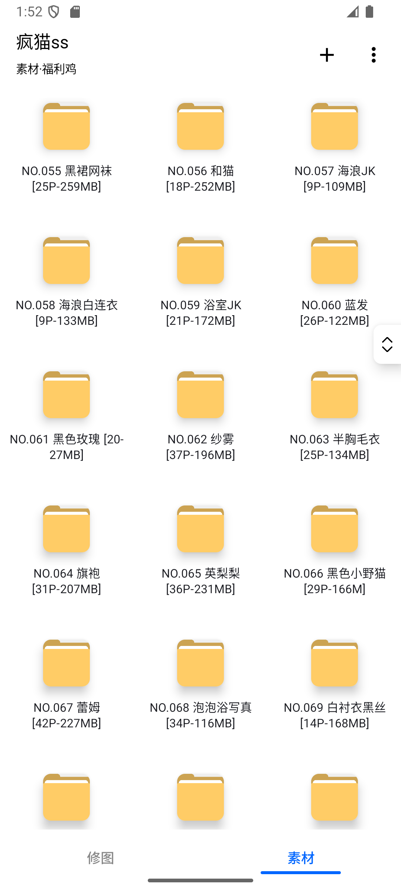
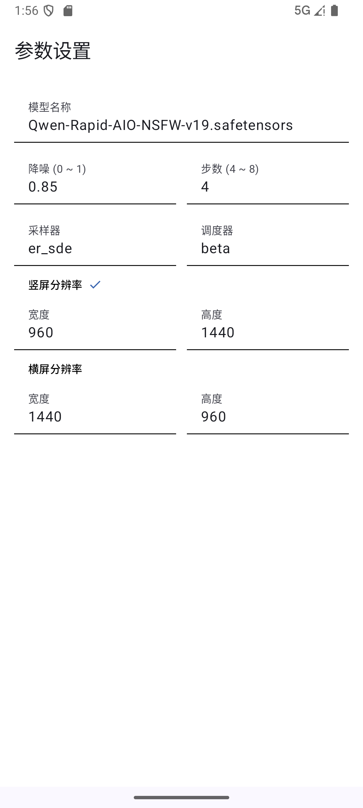
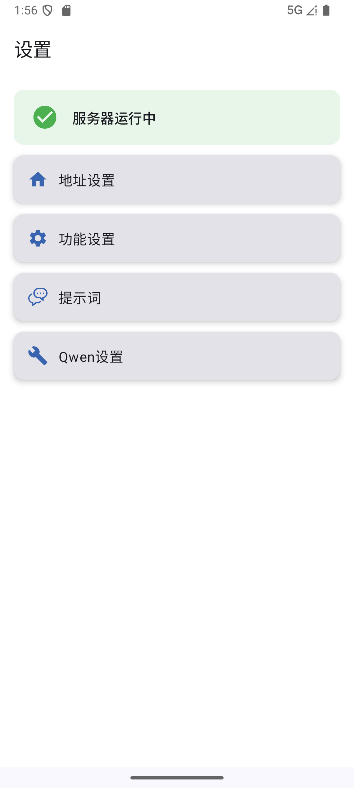
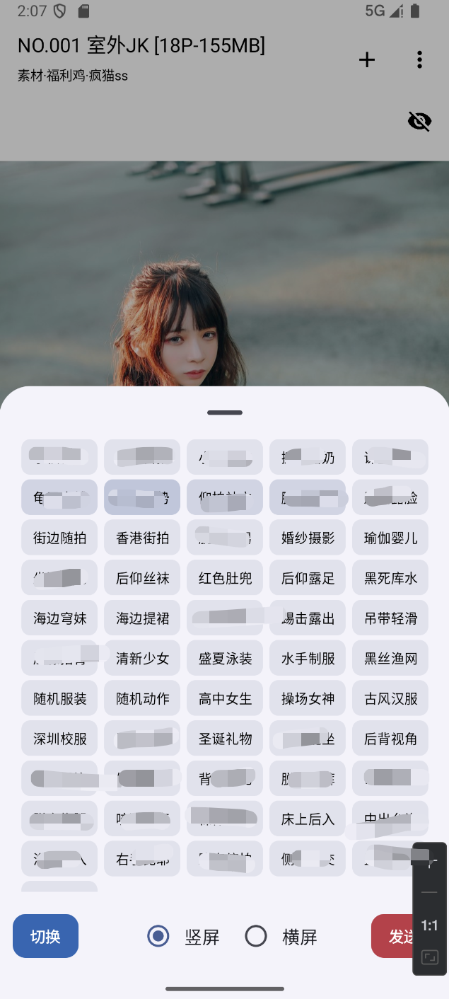

# 简介
为了更方便的使用comfyUI，特别是Qwen-Image-Edit-AIO模型的使用，开发此App。

# 功能
1. 瀑布流式图片展示与管理；
2. 调用Qwen模型生图；
3. 配置Qwen参数；
4. 保存提示词模板；
5. 服务器状态监测；
6. 任务监视管理；

# 预览

# 部署
1. 准备一个能运行Qwen-Image-Edit-AIO工作流的comfyUI环境，并且打开这个comfyUI的外部访问功能；
2. 通过docker-compose部署服务端，可采用sqlite或mariadb；
3. 在App填写服务端地址和密钥，重启App即可使用。

https://t.me/+nagsO_QfWvtjZDg1

